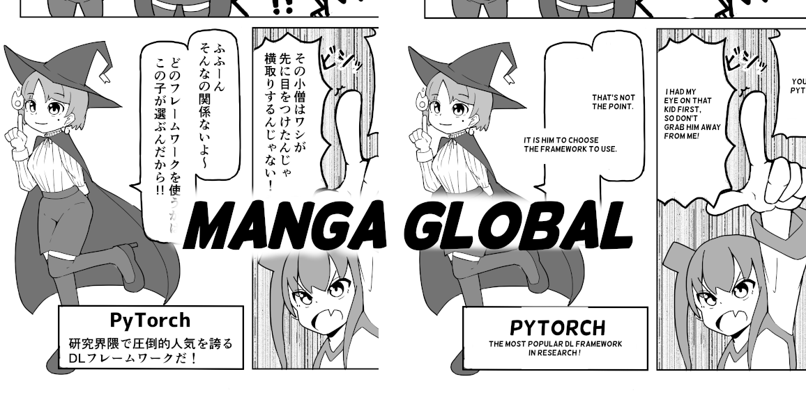
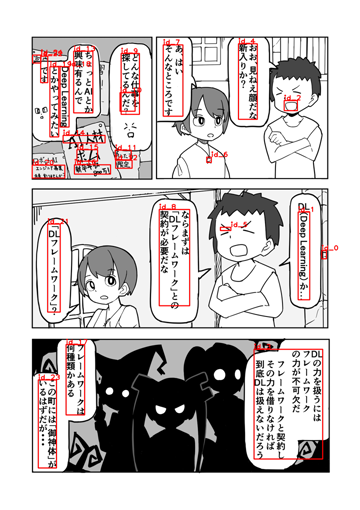
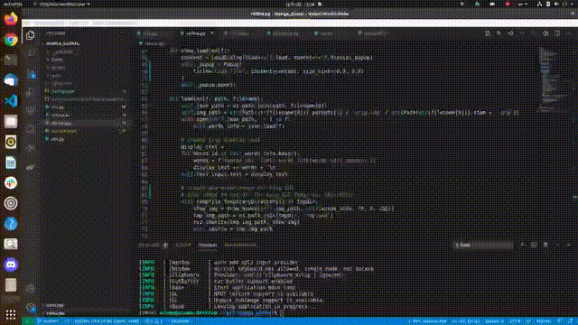
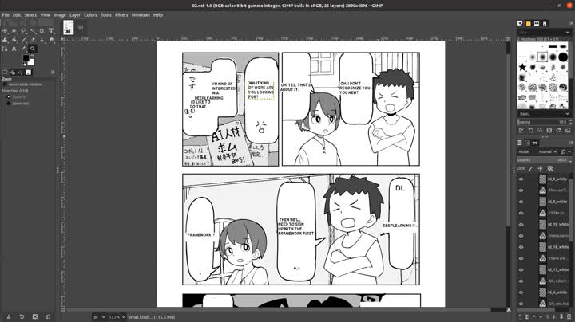

# Overview



Manga Global is a simple Manga Translation System. It generates a translated GIMP format data from an image.

# Setup
## GIMP
```
$ sudo apt install gimp

# python-fu
$ sudo apt install python-cairo python-gobject-2
$ wget http://mirror.ip-projects.de/ubuntu/pool/universe/p/pygtk/python-gtk2_2.24.0-6_amd64.deb
$ wget http://ftp.de.debian.org/debian/pool/main/g/gimp/gimp-python_2.10.8-2_amd64.deb
$ sudo dpkg -i python-gtk2_2.24.0-6_amd64.deb
$ sudo dpkg -i gimp-python_2.10.8-2_amd64.deb
```

## Python
```
$ pip install -r requirements.txt
```

## Google Vision API
We use OCR of Google Vision API. So first, you need to set up Google Vision API Environment.
https://cloud.google.com/vision

You need to get a service account key, and set the key path to `OCR_KEY_PATH` in `private_const.py`.  

## DEEPL API
We use DeepL. You need to get DeepL API Key, and set `DEEPL_AUTH_KEY` in `private_const.py`.

## Font
For kivy GUI System, download `mplus-2c-regular.ttf`, put under `fonts`.
https://www.wfonts.com/font/m-2c
```
$ mkdir fonts
$ mv path/to/mplus-2c-regular.ttf fonts
```

For GIMP Output, install `Helsinki`.
https://www.dafont.com/helsinki.font

# How to Use
## 1. Detect texts by OCR
Put images under some directory (`INPUT_DIR`), like `sample_imgs`.  
Run the following command, you can get ocr result images and jsons.
```
$ python ocr.py -i <INPUT_DIR> -o <OCR_OUTPUT_DIR>
```




## 2. (Additional Step) Fix OCR Results
Currently, OCR precision is not good enouth. It is better to fix results in gui. you can
- Remove abundant Box.
- Fix text contents.

```
$ python refine.py <OCR_OUTPUT_DIR>/jp_json
```




## 3. Translation
Run the following command, you can get gimp format data under `OCR_OUTPUT_DIR/gimp`.
```
$ python translate.py -i <OCR_OUTPUT_DIR> --is_translate
```


# Output Setting
You can control output font {size, type}, {input, output} language in `const.py`

